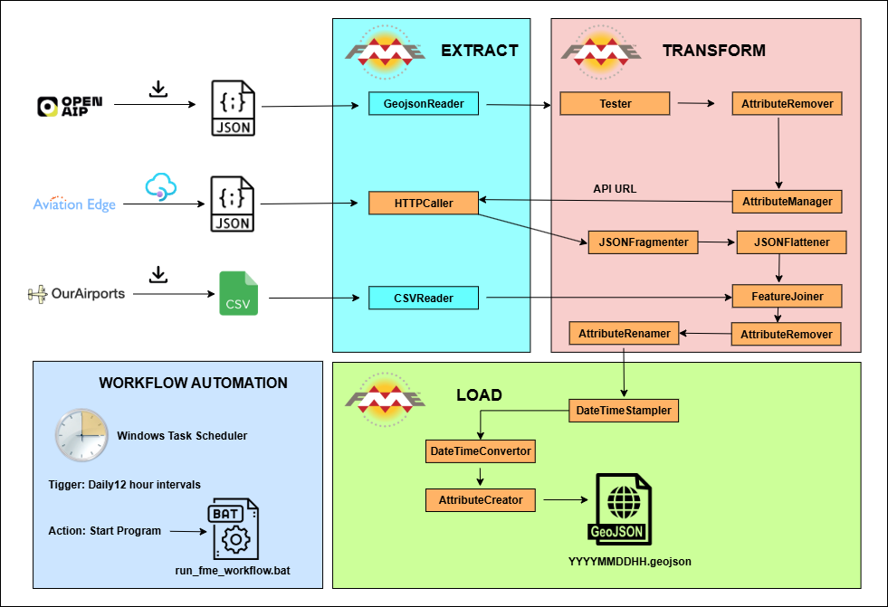

# Automated End-to-End ETL Workflow for European Air Traffic Data Lake Creation Using FME

## Repository Overview

This repository hosts the complete automated ETL pipeline designed to collect, process, and maintain a comprehensive Europe-wide air traffic data lake using FME Desktop. The system ingests real-time flight arrival and departure data from all European airports via the Aviation Edge API and combines it with detailed geo-spatial information of airports.

## **Technologies Used**


## **Introduction**

In today’s data-driven world, real-time integration and processing of vast amounts of information are critical for gaining timely insights and making informed decisions. This project focuses on building an end-to-end real-time big data pipeline for aviation data by leveraging API integration, JSON data formats, ETL process and FME Desktop for spatial data processing. Flight data from the Aviation Edge API is continuously ingested and transformed, enabling the creation of a comprehensive and scalable data lake. This big data lake serves as a centralized repository, allowing efficient storage, querying, and analysis of dynamic flight information. The workflow is automated using Windows Task Scheduler to ensure timely updates, facilitating real-time analytics and operational intelligence for the aviation industry.

## Objectives

- **Develop a robust pipeline for real-time ingestion of flight data** from the Aviation Edge API using API integration and JSON data formats.
- **Implement an ETL (Extract, Transform, Load) process** utilizing FME Desktop to efficiently process and transform raw spatial flight data for further analysis.
- **Design and build a scalable big data lake** to store and manage large volumes of dynamic aviation data, supporting efficient querying and analytics.
- **Automate the data ingestion and processing workflow** using Windows Task Scheduler to ensure continuous and timely updates of flight data.
- **Enable real-time analytics and operational insights** for aviation stakeholders by providing access to up-to-date, processed flight information.

## Data Sources

### 1. Aviation Edge API

[Aviation Edge API](https://aviation-edge.com/) supplies real-time flight schedule data, including arrivals and departures for airports globally. Using a secure API key, the project accesses endpoints to extract daily flight details for each EU airports.
  
### 2. OpenAIP

[OpenAIP](https://www.openaip.net/) provides detailed geographic and operational information about airports worldwide, including the European Union. For this project, GeoJSON file containing airport data was downloaded for all EU countries. 

### 3. OurAirports
[OurAirports](https://ourairports.com/) provides IATA codes for all airports globally.

## Methodology

The core workflow includes:

- **Data Extraction:** Automated retrieval of flight schedules through API calls using FME Desktop HTTP Caller transformer. Airport details are saved using CSV Writer and GeoJSON Writer.
- **Data Transformation:** Use of FME Desktop transformers to clean, enrich, and integrate the raw data into a consistent geo-spatial format (GeoJSON).
- **Data Loading:** Storage of processed data into a scalable data lake supporting real-time updates, saved as GeoJSON.
- **Automation:** Scheduled execution twice daily using Windows Task Scheduler to ensure up-to-date data availability.

The following diagram illustrates the end-to-end workflow and automation process implemented in this project. 



 ### **Data Extraction:**

The IATA codes for EU airports were extracted from the [OpenAIP](https://www.openaip.net/). These codes were then read into FME using the GeoJSON Writer. Based on these IATA codes, the API request URLs were dynamically generated within FME. These URLs serve as inputs for the HTTP Caller transformer in FME, which retrieves real-time flight schedule data from the [Aviation Edge API](https://aviation-edge.com/).

**Aviation Edge API: Airport Schedule Request**

To retrieve flight schedule data. The type of schedule either `departure` or `arrival`.
  
 **Arrival flight schedule**

  ```
   https://aviation-edge.com/v2/public/timetable?key=[API_KEY]&iataCode=[IATACODE]&type=arrival
  ```
**Departure flight schedule**
```
   https://aviation-edge.com/v2/public/timetable?key=[API_KEY]&iataCode=[IATACODE]&type=departure
  ```
Replace [API_KEY] in the API request URL with actual Aviation Edge API key. In the EU region, there are 444 major airports, and daily flight operations occur at approximately 250 of these airports. Consequently, each workflow run involves making 888 API calls (covering both arrivals and departures). However, the Aviation Edge API returns successful responses only for the airports with active flight operations—around 250 airports. For airports without flight activity on a given day, the API returns error responses.

Global airport details, including airport names and codes, were extracted from the [OurAirports](https://ourairports.com/) in CSV format. This comprehensive dataset was used to enrich the flight data and provide detailed airport information across all regions.

### **Data Transformation and Cleaning:**

The following FME transformers were used to clean, transform, and prepare the data for further processing:

- **Tester**: Filters features based on attribute values and conditions.  
- **Attribute Remover**: Deletes unnecessary or redundant attributes.  
- **Attribute Manager**: Creates, updates, or modifies attributes, including constructing API URLs.  
- **JSON Fragmenter**: Breaks down complex JSON objects into manageable fragments.  
- **JSON Flattener**: Converts nested JSON structures into flat attribute tables.  
- **Feature Joiner**: Combines features based on matching attribute values, such as joining airport IATA codes with airport detail attributes.  
- **Attribute Renamer**: Renames attributes to ensure consistency and clarity.  
- **Logger**: Captures API call errors to prevent termination of the API calling loop and supports troubleshooting.

### Data Loading

Processed data is stored in a scalable data lake that supports real-time updates. The data is saved as GeoJSON files using the **Feature Writer** transformer in FME. Each output file is named dynamically in the format `YYYYMMDDHH.geojson` by leveraging the **DateTime Stamper** and **DateTime Converter** transformers to generate the current date and hour. This automatic naming convention ensures organized and timestamped file storage for efficient data management and retrieval.

### Automation

The Aviation Edge API provides flight data covering approximately a 14-hour window per airport per request. Consequently, each execution of the workflow retrieves data for only a 14-hour period. To obtain a complete daily record, the workflow must be run twice per day, spaced roughly 12 hours apart. While **FME Flow** or **Cloud Virtual Machine with FME installation** would be the ideal tool for managing this scheduling automatically, access to it was unavailable. Therefore, a straightforward and effective solution was implemented using **Windows Task Scheduler** combined with a batch file to automate the execution. This setup enables extraction of monthly, daily, and real-time data reliably.

#### Batch File for Automation

Create a batch file (`run_fme_workflow.bat`) with the following content to run the FME workspace:

```batch
@echo off
REM Set path to FME executable
set FME_EXE="C:\Program Files\FME\fme.exe"

REM Run the workspace
%FME_EXE% "path to your folder\Automated-End-to-End-ETL-Workflow-for-European-Air-Traffic-Data-Lake-Creation-Using-FME\fme_workflow\airline_schedule.fmw"


REM Optional: redirect output to a log file (uncomment below to enable logging)
REM %FME_EXE% "path to your folder\Automated-End-to-End-ETL-Workflow-for-European-Air-Traffic-Data-Lake-Creation-Using-FME\fme_workflow\airline_schedule.fmw" > "path to your folder\Automated-End-to-End-ETL-Workflow-for-European-Air-Traffic-Data-Lake-Creation-Using-FME\fme_workflow\airline_schedule_log.txt" 2>&1
 ```

#### Windows Task Scheduler Setup

- Open **Task Scheduler** on Windows.
- Create a new task with the following configurations:
   - **Trigger:** Daily trigger, repeat every 12 hours (to run twice daily).
   - **Action:** Start a program → Browse and select the batch file created above (`run_fme_workflow.bat`).
- Save the task.

This approach automates your FME workflow execution, ensuring updated flight data is collected twice daily to cover the full 24-hour period.

## Usage of Data Lake

- Analyze daily EU air traffic records.  
- Combine data files to derive seasonal, monthly, and annual air traffic insights.  
- Provide input data for the Air Traffic Dashboard.  
- Rank EU airports and airlines based on arrivals and departures.

## Thank You!

Thank you for taking the time to explore this project.  

Happy coding! 🚀
